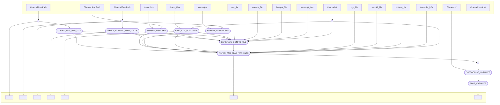

# dermatlas_tumour_only_calling_nf
[](https://www.nextflow.io/)
[](https://www.docker.com/)
[](https://sylabs.io/docs/)

## Introduction

`dermatlas_tumour_only_calling_nf` is a bioinformatics pipeline written in [Nextflow](http://www.nextflow.io) for identifying somatic variants from unmatched FFPE tumor samples within the Dermatlas project.

## Pipeline summary

In brief, the pipeline takes cohort(s) of tumour samples that have been pre-processed with `dermatlas_somatic_qc_nf` and

- Collates variants from matched normal-tumour samples in the cohort(s) for filtering recurrent technical artefacts and germline variants.
- Annotates common SNPs from the unmatched tumour samples using dbSNP.
- Counts germline variants in the matched normal samples for the cohort(s), so that they can be annotated in the unmatched tumour samples.
- Validates MNV variant calls in the unmatched tumour samples.
- Flags and filters variants in the unmatched tumour samples using the normal and matched tumour sample, dbSNP and germline counts.
- Annotates filtered variants in the unmatched tumour samples using a custom Dermatlas tiering system - which ranks variants based on their likely clinical significance and the strength of evidence supporting their veracity.
- Generates summary plots and reports for the unmatched tumour samples.


## Inputs 

- `germline_vcfs`: path to a list of germline VCFs from matched normal samples in the cohort (one VCF per line)
- `unmatched_somatic_vcfs`: path to a list of somatic VCFs from unmatched tumour samples in the cohort (one VCF per line).
- `matched_somatic_vcfs`: path to a list of somatic VCFs from unmatched tumour samples in the cohort (one VCF per line).
- `unmatched_maf`: path to a MAF file collated from the unmatched tumour samples in the cohort generated using `dermatlas_somatic_qc_nf`.
- `transcripts`:  path to a file containing Ensembl transcripts where we wish to modify the canonical transcript for accurate variant reporting.
- `transcript_info`:  path to a GTF file containing transcript information (exon locations used in fitering processed pseudogenes)
- `cgc_file`: path to a Cosmic Cancer Gene Census file for annotating variants
- `oncokb_file`: path to an  Onkokb file for annotating variants
- `hotspot_file`: path to a cancer hotspots file for annotating variants
- `dbsnp_file`: dbSNP VCF file for annotating common SNPs and its index file
- `release_version`: results release version (e.g. `1.0`)
- `sample_list`: path to a file containing sample IDs to retain in MAF and plot outputs (one ID per line)
- `outdir`: path to the directory where results will be written

## Usage 

The recommended way to launch this pipeline is using a wrapper script (e.g. `bsub < my_wrapper.sh`) that submits nextflow as a job and records the version (**e.g.** `-r 0.1.1`)  and the `.json` parameter file supplied for a run.

An example wrapper script is included in the `assets` directory (`assets/run_tumour_only.sh`)

When running the pipeline for the first time on the farm you will need to provide credentials to pull singularity containers from the team113 sanger gitlab. You should be able to do this by running

```module load singularity/3.11.4 
singularity remote login --username $(whoami) docker://gitlab-registry.internal.sanger.ac.uk
```

The pipeline can configured to run on either Sanger OpenStack secure-lustre instances or farm22 by changing the profile speicified:
`-profile secure_lustre` or `-profile farm22`. 

## Pipeline visualisation
Created using nextflow's in-built visualitation features.
```
nextflow run main.nf -preview -with-dag flowchart.mmd -params-file tests/testdata/test_params.json -profile secure_lustre
```




## Testing

This pipeline has been developed with the [nf-test](http://nf-test.com) testing framework. Unit tests and small test data are provided within the pipeline `test` subdirectory. A snapshot has been taken of the outputs of most steps in the pipeline to help detect regressions when editing. You can run all tests on openstack with:

```
nf-test test 
```
and individual tests with:
```
nf-test test tests/modules/ascat_exomes.nf.test
```

For faster testing of the flow of data through the pipeline **without running any of the tools involved**, stubs have been provided to mock the results of each succesful step.
```
nextflow run main.nf \
-params-file params.json \
-c tests/nextflow.config \
--stub-run
```


